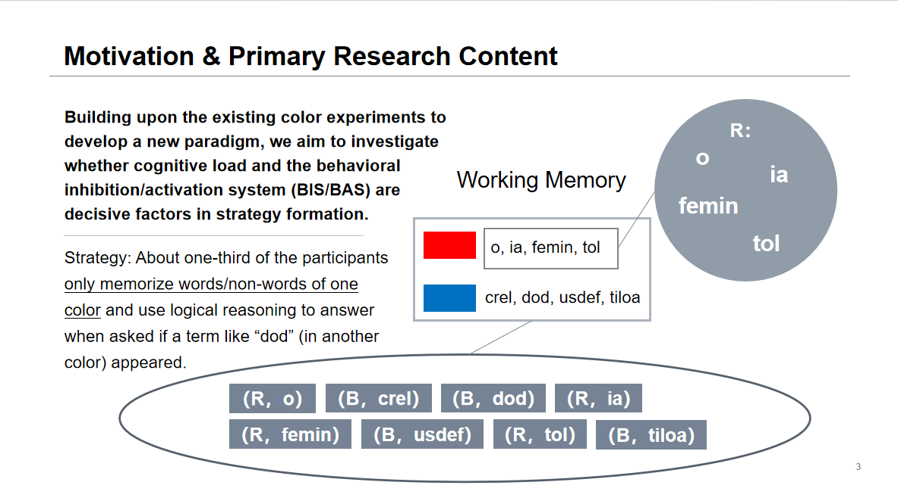
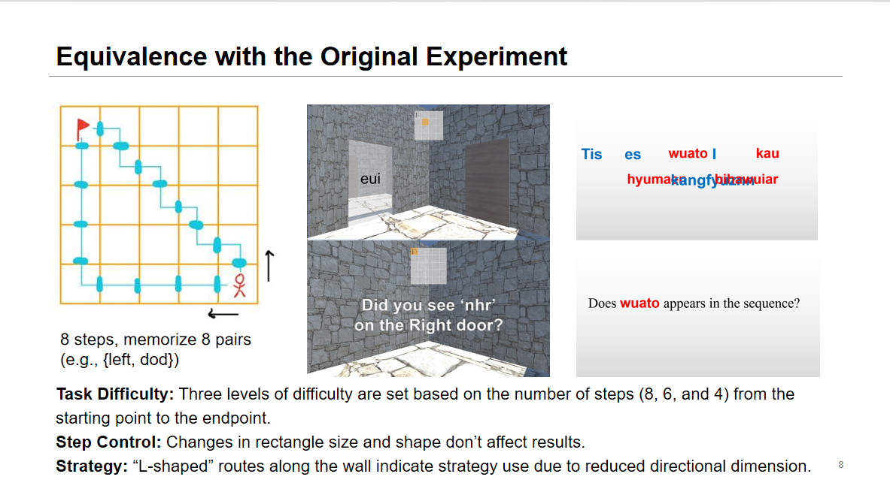

When faced with difficulties or challenges, humans always manage to spontaneously form optimized strategies to improve their situations. Unlike artificial intelligence which relies on specific optimization algorithms, the process by which humans develop strategies is flexible, innovative, and adaptable to specific circumstances. For me, this sparks curiosity about the underlying neural mechanisms.

## Related Topics
- Information Compression
- Dimension Reduction
- Reinforcement Learning
- Evidence accumulation and jump
- Metacognition

## Previous Experiences as Motivation

In 2022, I found in behavioral experiments that 3 out of 11 participants adopted the same strategy for a color non-word memory task. Upon analyzing this phenomenon, I provided the following interpretation: Color and non-words represent two dimensions of working memory processing and storage. For a sequence containing 8 non-words that are either blue or red, participants need to memorize a total of 8 mappings, or 16 elements (8 non-words and their corresponding color). By adopting a strategy, participants choose to memorize non-words of only blue or red, compressing the content they need to remember to just those non-words associated with one color, significantly reducing the task load. This behavior seems to be an optimization strategy which compresses information.

In addition to the color non-word memory task, participants also completed a spatial non-word memory task. However, due to differences in the paradigm or potential confounding factors, findings in this paradigm differed from the color non-word memory task: In the color non-word paradigm, participants developed a strategy after repeating the sequence memorization several times, whereas in the spatial non-word paradigm, participants identified a strategy right from the start of the experiment.

This prompts me to ponder: Does the generation of optimization strategies in the human brain not require accumulated experience (from task trials) and can instead be inferred ahead? If we make slight modifications to the spatial non-word task, removing the navigation mini-map from the view, would participants still be able to form strategies quickly?
